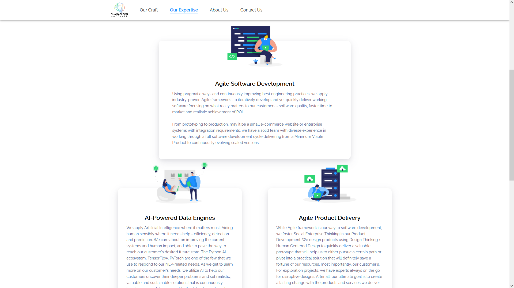
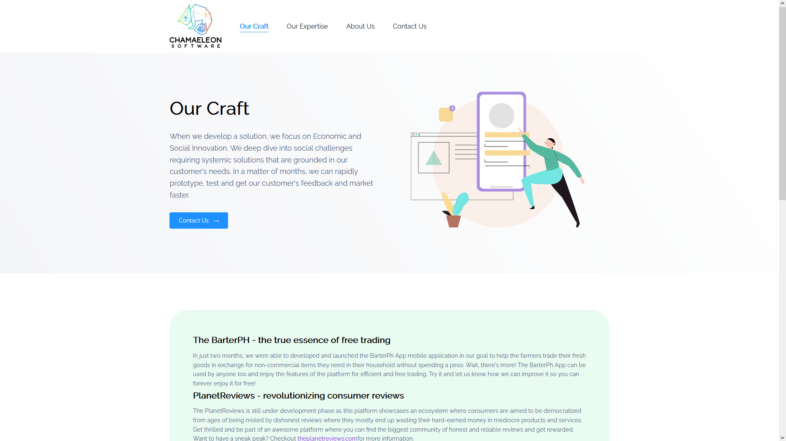
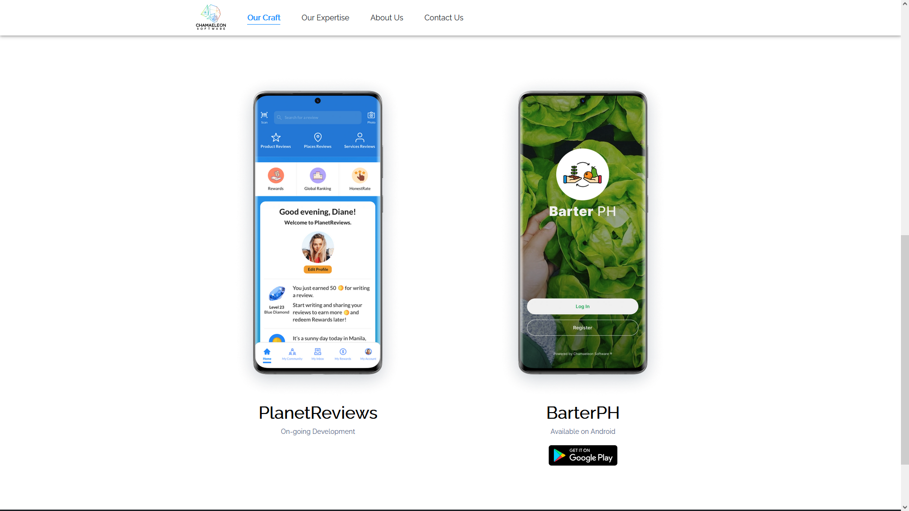
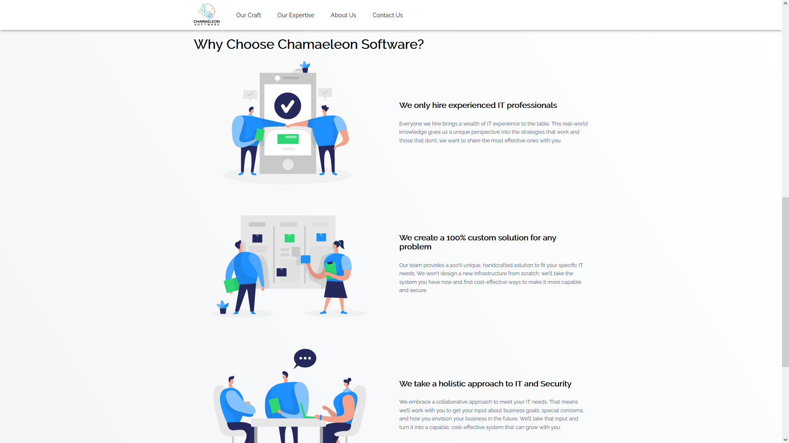
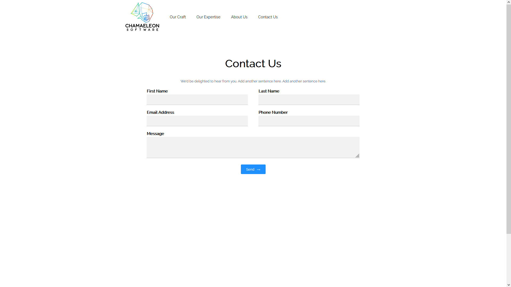

# Pythagoras Web

_September 07, 2020_

This is a commisioned build for a Startup IT Company, Chamaeleon Software, as their companies' website landing page and showcase of their products.

The build is deployed [here](https://chamaeleon.io).

### Technologies used

- ReactJS - Front-end
- Sass - Styling

Here are some Screenshots of the application. [See More](https://www.figma.com/file/zBXeFQDOvzYH2xl839JHRU/Chamaeleon-Website).

 
<strong>Expertise Tab</strong>

 
<strong>Out Craft Tab</strong>

 
<strong>Contact Us Tab</strong>

    
COPYRIGHT © 2020

    
Chamaeleon Software, All Rights Reservered

